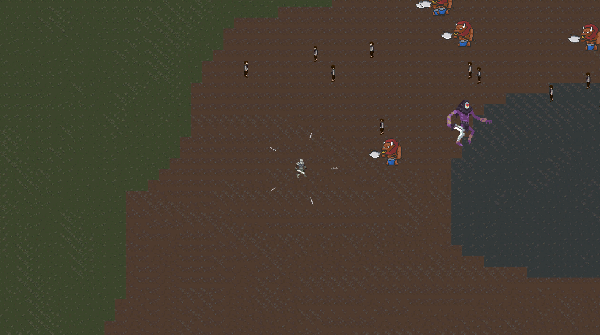

# Vampire-Survivor

School project in Unity

## Presentation

### Description

Replica of the base mechanics of Vampire Survivor game

The player win after 15 minutes.

### Features

#### Player

- Movements with Arrows keys / ZQSD
- 3 differents attacks:
  - A temporary laser beam
  - A swords halo around the player
  - An arrow that shoot the nearest enemy
- Enemies
  - Differents specs (speed, health, damage)
  - Spawn randomly outside the player screen all along the game
  - Move to the player automatically
  - Attack the player when in range
  - More the game progress, more enemies' specs increase except for the movement speed
  - Drop a XP orb when dying
- XP (orbs)
  - Give XP to the player when picked
  - Disappear after 15 seconds
  - When a certain amount of XP is reached, the player level up
- Menus
  - Start Menu: Play / Quit
  - Pause Menu: Resume / Quit
  - Death UI: Before showing the Game Over Menu
  - Game Over Menu: Restart / Quit
- Map
  - 1 playable map

## Technical

- Unity 2022.3.9f1
- C#
- 2D

## Assets Credits

- [Sanctum Pixel](https://sanctumpixel.itch.io/) for the **Sword man**
- [Szadiart](https://szadiart.itch.io/) for the **RPG Worlds Caves Tilemap**
- [George Chandler](https://george-chandler.itch.io/) for the **Swords pack**
- [Kenam0](https://kenam0.itch.io/) for the **Arrows pack**
- [Ozanoyunbozan](https://ozanoyunbozan.itch.io/) for the **Grumpy mayor**
- [Elthen](https://elthen.itch.io/) for the **Minautor sprites**
- [Clembod](https://clembod.itch.io/) for the **Bringer Of Death**
